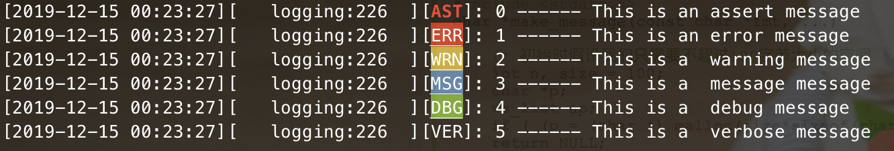

<!-- START doctoc generated TOC please keep comment here to allow auto update -->
<!-- DON'T EDIT THIS SECTION, INSTEAD RE-RUN doctoc TO UPDATE -->

- [Architecture](#architecture)
  - [IPC Strategy](#ipc-strategy)
- [CLI](#cli)
- [MNG](#mng)
- [CFG](#cfg)
  - [What information needs to be stored in config file](#what-information-needs-to-be-stored-in-config-file)
    - [Provisioner](#provisioner)
    - [Network & Nodes](#network--nodes)
- [Utils](#utils)
  - [Logging](#logging)

<!-- END doctoc generated TOC please keep comment here to allow auto update -->

---

## Architecture

[ProcessOn](https://www.processon.com/diagraming/5a581bfae4b0332f15299433)

3 parts: CLI, MNG, CFG

These 3 parts can be completely separated.

### IPC Strategy

Unix domain socket.

Header types:

| Header | Description    |
| ------ | -------------- |
| 0x01   | Command Start  |
| 0x02   | Response       |
| 0x03   | Command End    |
| 0x04   | Anonmous Event |

IPC between CLI and MNG.

It's always the CLI process which sends the "Command Start", then it waits for "Response" and "Command End" either in blocking or non-blocking mode.

## CLI

The command line interface process, which receives commands from user and outputs the status.

Supported commands

Conventions:

- Argument in \[\] means normal argument.
- Argument in &lt;&gt; means that the argument is optional to present, in this
  case, argument(s) probably have default value(s).
- Argument followed by ... means variable number of the argument.
- Content in \(\) following a argument is illustrative.

|  Command  |             Args             | Defaults |       Usage        | Description                                                                              |
| :-------: | :--------------------------: | :------: | :----------------: | ---------------------------------------------------------------------------------------- |
|   sync    |              \               |    \     |        sync        | Synchronize the network configuration with the JSON file                                 |
|   reset   | &lt;1(Factory)/0(Normal)&gt; |    0     |       reset        | Reset the device, if args 1, erase the storage                                           |
|   list    |              \               |    \     |        list        | List all the devices in the provisioner device database, including UUID, Device key etc. |
|     q     |              \               |    \     |         q          | Quit the program                                                                         |
| blacklist |       &lt;addr...&gt;        |    \     | blacklist 0x112c 2 | Blacklisting the specific node(s)                                                        |
|  remove   |       &lt;addr...&gt;        |    \     |  remove 0x120c 2   | Removing the specific node(s)                                                            |

Table x: Network Configuration Commands

|  Command  |           Args            |           Usage            | Description                            |
| :-------: | :-----------------------: | :------------------------: | -------------------------------------- |
|   onoff   |  \[on/off\] \[addr...\]   |   onoff on 0x1203 0x100c   | Set the light onoff status             |
| lightness | \[pecentage\] \[addr...\] | lightness 50 0x1203 0x100c | Set the light lightness status         |
| colortemp | \[pecentage\] \[addr...\] | colortemp 30 0x1203 0x100c | Set the light color temperature status |

Table x: Lighting Control Commands

For example:
lightness 50 0x1203 0x100c - set the lightness of the lights whose address is 0x1203 or 0x100c to 50%

## MNG

## CFG

### What information needs to be stored in config file

#### Provisioner

|         What's it          |   Key    |   Value    | Description |
| :------------------------: | :------: | :--------: | ----------- |
| Last sync time1 | SyncTime | time_t TBD |             |
|          IV index          |   IVI    |   uint32   |             |
|            Keys            |    \     |     \      |             |

|       What's it       |  Key  | Value | Description |
| :-------------------: | :---: | :---: | ----------- |
|     Reference ID      | RefId | bool  |             |
| Created successfully? | Done  | bool  |             |

1. By checking the last modification time against last synchronized time to know
   if the configuration is changed out of the program.

#### Network & Nodes

|    What's it    | Key  | Value  | Description |
| :-------------: | :--: | :----: | ----------- |
| Unicast address | Addr | uint16 |             |
|    IV index     | IVI  | uint32 |             |

## Utils

This part can be used by any other parts as utils.

### Logging

Logging has the level feature which is inspired from Android logging system.

| Key word | Meaning | Note                                          |
| -------- | ------- | --------------------------------------------- |
| AST      | assert  | Assert, call assert(0) directly, NON-MASKABLE |
| ERR      | error   |                                               |
| WRN      | warning |                                               |
| MSG      | message |                                               |
| DBG      | debug   |                                               |
| VER      | verbose |                                               |

Format: \[Time\]\[File:Line]\[Level\]: Log Message...  
\[2019-12-12 21:22:33\]\[xxx_source_xxx.c:225][MSG]: Initializing...

