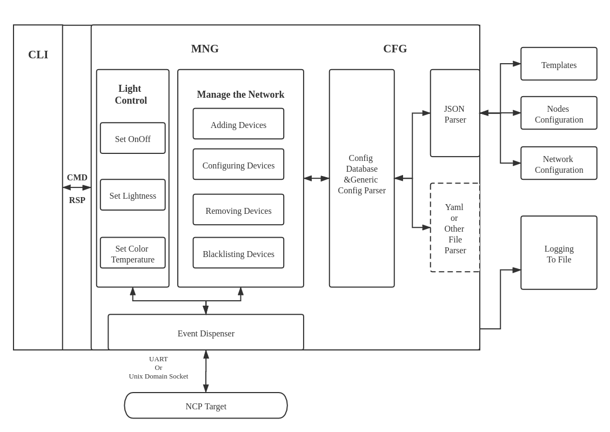

<!-- Author: Zhen Fu -->

# BT Mesh Host Network Manager (Provsioner)

A provisioner plays an important role in the Bluetooth Mesh network, which
creates and manages the network by adding, configuring and removing devices
into/from the network. This article will provide you a ncp host example which
works with the ncp target to act as the provisioner. For more information about
the ncp mode and ncp host and target, please go through
[KBA_BT_1602: NCP Host Implementation and Example](https://www.silabs.com/community/wireless/bluetooth/knowledge-base.entry.html/2018/01/18/ncp_host_implementat-PEsT).

Prior to this example, we have the SoC mode provisioner example introduced in
[KBA_BT_0501: BT Mesh embedded provisioner example](https://www.silabs.com/community/wireless/bluetooth/knowledge-base.entry.html/2018/05/31/bt_mesh_embeddedpro-qoHB),
it has the full implementation of provisioning and configuring a device into a
network and is **easier to understand and more suitable for beginners**.
However, it has below limitations:

- In SoC mode, only 14 devices can be added to the same network, while in ncp
  mode, it supports to add up to **512 devices** for now.
- Application and network configuration are fixed at the compiling time, any
  changes to the network require to re-build and flash the provsioner.
- Due to the limitation of the resources on the WSTK, it has limited features.

Given the above limitations, the host network manager was developed with below
ideas in mind.

- Make it as automatic as possible so that it can be used for automatic testing.
- Separate the application and configuration, so that it doesn't need to rebuild
  the application to apply any configuration changes to the network.
- Configuration file can be changed at any time, the application will check if
  needs to reload them before issuing a command.
- Robustness improvement, every process may fail because of any reason. Retry
  and some recovery mechanisms are needed to make the network more robust.
- A console to receive commands from the user. Easy to add any customized
  command to extend the application.

## Capabilities

The host network manager supports below functionalities:

- Create network and application keys
- Provision multiple devices into a network simultaneously
- Configure multiple devices simultaneously
  - Add application keys
  - Bind application keys to models
  - Set publication address to models
  - Add subscription addresses to models
  - Set default TTL value
  - Set relay/friend/proxy feature on or off
  - Set the network/relay transmission - count and interval
  - Set Secure Network Beacon on or off
- Remove devices from a network via node reset procedure
- Blacklist devices from a network via key refresh procedure
- Set the light status
  - On or off
  - Lightness
  - Color temperature

**NOTE**: Removing a node is different than blacklisting a node from the network.
Removing is like to ask the node to leave the network actively - provisioner
sends a command to force the node to factory reset itself, while blacklist is
passively being blacklisted from the network - provisioner sends packets to
the reset of the nodes to migrate to a new network key, see table 1. For more
information, you can go through [KBA_BT_0510: Blacklisting Nodes From Bluetooth Mesh Network](https://www.silabs.com/community/wireless/bluetooth/knowledge-base.entry.html/2019/07/11/kba_bt_0510_blacklistingnodesfrombluetoothmes-PTor).

|                      | Remove                        | Blacklist           |
| :------------------- | :---------------------------- | :------------------ |
| Network key change   | No                            | Yes                 |
| Before the procedure | Target needs to work normally | Doesn't matter      |
| After the procedure  | Factory reset                 | Remaining unchanged |

Table 1. Comparison between removing and blacklisting

## Dependencies

### Hardware & SDK

- IDE – [Simplicity Studio 4](http://www.silabs.com/products/mcu/Pages/simplicity-studio.aspx)
- SDK – Bluetooth Mesh SDK 1.6.0 GA or newer, the **latest version is always
  recommended**.
- NCP target – WSTK with Bluetooth Mesh compatible radio boards - EFR32xG12,
  EFR32xG13 or EFR32MG21 (x= M, B) based.
- NCP host - **POSIX compatiable** machine to run the host application, **THIS
  HAS ONLY BEEN TESTED ON Linux and MacOS**. Running the application on Windows
  or other platforms probably needs some porting afford.

### Libraries

This project uses the open source library for parsing the JSON configuration
files and glib for the data structures. Users needs to install the libraries
properly before using the example.

- json-c - Download and install it from https://github.com/json-c/json-c.
- glib - Download and install it from https://developer.gnome.org/

---

## Architecture

Figure 1. Functional Diagram

The architecture of the host network manager is as shown in figure 1. Below is
a brief introduction to each module in this diagram.

- Event dispenser - read events from NCP target and dispense them to all modules.
- Generic config parser - Abstract layer for parsing different types of config
  files, provides the configuration to all other modules.
- Config Database - Store all the configuration, including network and nodes
  configuration
- MNG - Loads the configuration from CFG part and deploy to the network.
- Logging - Receives data from other layers and writes to the log file.
- CLI - Receives user input.

Limitation of this design - Only **ONE** subnet is supported. Multiple subnets
feature is supported by the Bluetooth Mesh SDK, however, the requirements for
multiple subnets in practice is rare, so leave it for future implementation.

Generally, there are 3 parts in the program, CLI, MNG and CFG.

## CLI

The command line interface part receives commands from user and pass them to
MNG for further processing if needed.

Supported commands

Conventions:

- Argument in \[\] means normal argument.
- Argument in &lt;&gt; means that the argument is optional to present, in this
  case, argument(s) probably have default value(s).
- Argument followed by ... means variable number of the argument.
- Content in \(\) following a argument is illustrative.

| Command  |             Args             | Defaults |    Usage    | Description                                                                                                                                                     |
| :------: | :--------------------------: | :------: | :---------: | --------------------------------------------------------------------------------------------------------------------------------------------------------------- |
|   sync   |           \[1/0\]            |    1     |    sync     | Start or stop synchronizing the network configuration with the JSON file                                                                                        |
|  reset   | &lt;1(Factory)/0(Normal)&gt; |    0     |    reset    | Reset the device, if argument is 1, erase the storage                                                                                                           |
|   info   |         \[addr...\]          |    /     | info 0x003a | If no argument is given, shows the overall configuration of the network, if address is given, shows configuration for the node, including UUID, Device key etc. |
|    q     |              \               |    /     |      q      | Quit the program                                                                                                                                                |
| freemode |          \[on/off\]          |    on    | freemode on | Turning on/off the free mode.                                                                                                                                   |
|   help   |              \               |    \     |    help     | Print the usage of all commands.                                                                                                                                |
|  status  |              \               |    \     |   status    | Print the device status.                                                                                                                                        |

Table x: Network Configuration Commands

|  Command  |           Args            |           Usage            | Description                                                                             |
| :-------: | :-----------------------: | :------------------------: | --------------------------------------------------------------------------------------- |
|   onoff   |  \[on/off\] \[addr...\]   |   onoff on 0x1203 0x100c   | Set the light onoff status, if no argument is given, set to all light nodes             |
| lightness | \[pecentage\] \[addr...\] | lightness 50 0x1203 0x100c | Set the light lightness status, if no argument is given, set to all light nodes         |
| colortemp | \[pecentage\] \[addr...\] | colortemp 30 0x1203 0x100c | Set the light color temperature status, if no argument is given, set to all light nodes |

Table x: Lighting Control Commands

## MNG

## CFG

### What information needs to be stored in config file

#### Provisioner

|         What's it          |    Key    |    Value    | Description      |
| :------------------------: | :-------: | :---------: | ---------------- |
| Last sync time1 | SyncTime  | time_t TBD  |                  |
|          IV index          |    IVI    |   uint32    |                  |
|            Keys            |    \      |     \       | Table x          |
|   Network Transmit Count   |   TxCnt   |    uint8    | [0, 7]           |
| Network Transmit Interval  |  TxIntv   |    uint8    | [10, 320]@step10 |
|       Added Devices        |  Devices  | uint16array | (0, 0x7fff]      |
|     Publication Groups     | PubGroups | uint16array | [0xc000, 0xfeff] |
|    Subscription Groups     | SubGroups | uint16array | [0xc000, 0xfeff] |

Table x. Provisioner Config File Content

1. By checking the last modification time against last synchronized time to know
   if the configuration is changed out of the program.

|        What's it         |  Key  |      Value      | Description |
| :----------------------: | :---: | :-------------: | ----------- |
| Reference ID1 | RefId |     uint16      |             |
|        Key Index         |  Id   |     uint16      |             |
|        Key Value         | Value | 16BL uint8array |             |
|  Created successfully?   | Done  |      bool       |             |

Table x. Key Content

1. The read id is allocated when the key is created successfully, however, in most of the cases, configuration of the network happens before it.

#### Network & Nodes

|    What's it    | Key  | Value  | Description |
| :-------------: | :--: | :----: | ----------- |
| Unicast address | Addr | uint16 |             |
|    IV index     | IVI  | uint32 |             |

Table x. Network & Nodes Config File Content

## Utils

This part can be used by any other parts as utils.

### Logging

Logging has the level feature which is inspired from Android logging system.

| Key word | Meaning | Note                                          |
| -------- | ------- | --------------------------------------------- |
| AST      | assert  | Assert, call assert(0) directly, NON-MASKABLE |
| ERR      | error   |                                               |
| WRN      | warning |                                               |
| MSG      | message |                                               |
| DBG      | debug   |                                               |
| VER      | verbose |                                               |

Format: \[Time\]\[File:Line]\[Level\]: Log Message...  
\[2019-12-12 21:22:33\]\[xxx_source_xxx.c:225][MSG]: Initializing...

### Recommended NCP Target Configuration

| Item                    | Value     | Note                                         |
| ----------------------- | --------- | -------------------------------------------- |
| Feature bitmask         | 0x0001    |                                              |
| RPL size                | 128(0x80) | set to the expected network size if possible |
| Net Cache Size          | 128(0x80) | set to the expected network size if possible |
| Max Provisioned Devices | 128(0x80) | set to the expected network size             |
