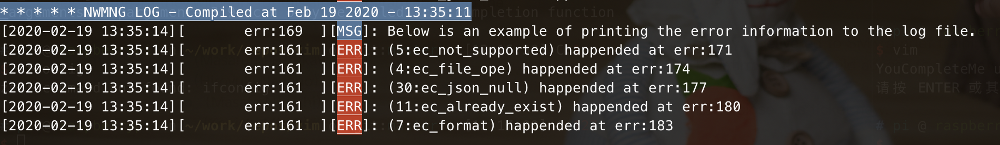

<!-- Author: Zhen Fu -->

# BT Mesh Host Network Manager (Provsioner)

A provisioner plays an important role in the Bluetooth Mesh network, which
creates and manages the network by adding, configuring and removing devices
into/from the network. This article will provide you a ncp host example which
works with the ncp target to act as the provisioner. For more information about
the ncp mode and ncp host and target, please go through
[KBA_BT_1602: NCP Host Implementation and Example](https://www.silabs.com/community/wireless/bluetooth/knowledge-base.entry.html/2018/01/18/ncp_host_implementat-PEsT).

Prior to this example, we have the SoC mode provisioner example introduced in
[KBA_BT_0501: BT Mesh embedded provisioner example](https://www.silabs.com/community/wireless/bluetooth/knowledge-base.entry.html/2018/05/31/bt_mesh_embeddedpro-qoHB),
it has the full implementation of provisioning and configuring a device into a
network and is **easier to understand and more suitable for beginners**.
However, it has below limitations:

- In SoC mode, only 14 devices can be added to the same network, while in ncp
  mode, it supports to add up to **512 devices** for now.
- Application and network configuration are fixed at the compiling time, any
  changes to the network require to re-build and flash the provsioner.
- Due to the limitation of the resources on the WSTK, it has limited features.

Given the above limitations, the host network manager was developed with below
ideas in mind.

- Make it as automatic as possible so that it can be used for automatic testing.
- Separate the application and configuration, so that it doesn't need to rebuild
  the application to apply any configuration changes to the network.
- Configuration file can be changed at any time, the application will check if
  needs to reload them before issuing a command.
- Robustness improvement, every process may fail because of any reason. Retry
  and some recovery mechanisms are needed to make the network more robust.
- A console to receive commands from the user. Easy to add any customized
  command to extend the application.

## Capabilities

---

The host network manager supports below functionalities:

- Create network and application keys
- Provision multiple devices into a network simultaneously
- Configure multiple devices simultaneously
  - Add application keys
  - Bind application keys to models
  - Set publication address to models
  - Add subscription addresses to models
  - Set default TTL value
  - Set relay/friend/proxy feature on or off
  - Set the network/relay transmission - count and interval
  - Set Secure Network Beacon on or off
- Remove devices from a network via node reset procedure
- Blacklist devices from a network via key refresh procedure
- Set the light status
  - On or off
  - Lightness
  - Color temperature

**NOTE**: Removing a node is different than blacklisting a node from the network.
Removing is like to ask the node to leave the network actively - provisioner
sends a command to force the node to factory reset itself, while blacklist is
passively being blacklisted from the network - provisioner sends packets to
the reset of the nodes to migrate to a new network key, see table 1. For more
information, you can go through [KBA_BT_0510: Blacklisting Nodes From Bluetooth Mesh Network](https://www.silabs.com/community/wireless/bluetooth/knowledge-base.entry.html/2019/07/11/kba_bt_0510_blacklistingnodesfrombluetoothmes-PTor).

|                      | Remove                        | Blacklist           |
| :------------------- | :---------------------------- | :------------------ |
| Network key change   | No                            | Yes                 |
| Before the procedure | Target needs to work normally | Doesn't matter      |
| After the procedure  | Factory reset                 | Remaining unchanged |

Table 1. Comparison between removing and blacklisting

## Dependencies

### Hardware & SDK

- IDE – [Simplicity Studio 4](http://www.silabs.com/products/mcu/Pages/simplicity-studio.aspx)
- SDK – Bluetooth Mesh SDK 1.6.0 GA or newer, the **latest version is always
  recommended**.
- NCP target – WSTK with Bluetooth Mesh compatible radio boards - EFR32xG12,
  EFR32xG13 or EFR32MG21 (x= M, B) based.
- NCP host - **POSIX compatiable** machine to run the host application, **THIS
  HAS ONLY BEEN TESTED ON Linux and MacOS**. Running the application on Windows
  or other platforms probably needs some porting afford.

### Libraries

This project uses the open source library for parsing the JSON configuration
files and glib for the data structures. Users needs to install the libraries
properly before using the example.

- json-c - Download and install it from https://github.com/json-c/json-c.
- glib - Download and install it from https://developer.gnome.org/
- readline - Download and install it from http://tiswww.case.edu/php/chet/readline/rltop.html

## Architecture

---

Figure 1. Functional Diagram

The architecture of the host network manager is as shown in figure 1. Below is
a brief introduction to each module in this diagram.

- Event Handler - read BGAPI events from NCP target and dispatch them to
  corresponding modules.
- Generic Config Parser - An abstract layer for parsing different types of
  config files, which provides the configuration to all other modules.
- Configuration Database - Store all the configuration, including network and
  nodes configuration
- MNG - Loads the configuration from CFG part and deploy to the network.
- Logging - Receives data from other layers and writes to the log file.
- CLI - Receives user input.

Limitation of this design - Only **ONE** subnet is supported, while multiple
subnets feature is supported by the Bluetooth Mesh SDK. It's because the
requirements for multiple subnets in practice is not very common yet, so just
leave it for future implementation.

Generally, there are 3 parts in the program, CLI, MNG and CFG.

## CLI

The command line interface part receives commands from user and pass them to
MNG for further processing if needed.

Supported commands

Conventions:

- Each \[\] stands for an argument iteam, some of them are mandatory to present
  and some are not, in which case, a default value of the argument is applied.
- Argument followed by ... means variable number of the argument.

|       Command        |             Args             | Defaults |    Usage    | Description                                                                                                                                                                 |
| :------------------: | :--------------------------: | :------: | :---------: | --------------------------------------------------------------------------------------------------------------------------------------------------------------------------- |
|         sync         |           \[1/0\]            |    1     |    sync     | Start or stop synchronizing the network configuration with the JSON configuration files                                                                                     |
|        reset         |            [1/0]             |    0     |    reset    | Reset the device, if argument is 1, erase the storage as well, known as factory reset                                                                                       |
|         info         |         \[addr...\]          |    /     | info 0x003a | If no argument is given, shows the overall configuration of the network, if address is given, shows the specific configuration to the node, including UUID, Device key etc. |
|          q           |              \               |    /     |      q      | Quit the program                                                                                                                                                            |
| freemode1 |          \[on/off\]          |    on    | freemode on | Turning on/off the free mode.                                                                                                                                               |
|         help         |              \               |    \     |    help     | Print the usage of all commands.                                                                                                                                            |
|        status        |              \               |    \     |   status    | Print the device status.                                                                                                                                                    |
|        rmall         |              \               |    \     |    rmall    | Remove all the nodes from the network                                                                                                                                       |
|        clrrb         |              \               |    \     |    clrrb    | Clear the RM_Blacklist fieldof the nodes                                                                                                                                    |
|        seqset        | combination of a, r, b and - |    \     | seqset ar-  | determine the sequence of loadding the adding/removing/blacklisting/none actions.                                                                                           |
|      loglvlset       |    \[e/w/m/d/v\] \[1/0\]     |    \     | loglvlset w | Log with priority "warning" or higher will be sent to the log file, the second parameter determines if the logging will be sent to printf (stdout if not redirect)          |

Table 2: Network Configuration Commands

|  Command  |           Args            |           Usage            | Description                                                                            |
| :-------: | :-----------------------: | :------------------------: | -------------------------------------------------------------------------------------- |
|   onoff   |  \[on/off\] \[addr...\]   |   onoff on 0x1203 0x100c   | Set the light onoff status, if no address is given, set to all light nodes             |
| lightness | \[pecentage\] \[addr...\] | lightness 50 0x1203 0x100c | Set the light lightness status, if no address is given, set to all light nodes         |
| colortemp | \[pecentage\] \[addr...\] | colortemp 30 0x1203 0x100c | Set the light color temperature status, if no address is given, set to all light nodes |

Table 3: Lighting Control Commands

1. When freemode is on, the device will start scanning for unprovisioned device
   beacon and record the device information to the backlog in the nodes
   configuration file if found.

## MNG

The MNG part is the core part of the application, which coprate with the other
two parts and make sure the network is properly configured according to the
configuration files and the received commands.

### Features

#### Simultaneously Provision and Configure Devices

Silicon Labs Bluetooth Mesh SDK **supports** this feature, as most of the demos
uses a 'single thread' way to do it (provision one -> configure one ->
provision another -> ...), users may be misled that provision/configure the
next device must wait for the compete of the previous one.

To benefit from this, you need to set the 2 fields in the "Memory
Configuration" in the NCP target isc file.

- Max Prov Sessions - this determines how many devices can be provisioned by
  the provisioner simultaneously. There is a define **#define MAX_PROV_SESSIONS
  4** in _adding_devices.h_ of the host project, this value must be equal or
  less than the setting in the NCP target memory configuration.

- Max Foundation Client Cmds - this determines how many nodes can be configured
  by the provisioner simultaneously. There is a define **#define
  MAX_CONCURRENT_CONFIG_NODES 6** in _async_config_client.c_ of the host
  project, this value must be equal or less than the setting in the NCP target
  memory configuration.

Below is a rough time comparison of provisioning and configuring a 50-node
network between using 'single thread' way and the asynchronous way. The time
itself is meaningless because it heavily depends on the environment, how you
configure each node, how many retries for timeouts and interval between retries
etc..

- 'Single thread' way - around 20 minutes
- Asynchronous way - around 4.5 minutes

### Retry

Due to the nature of Bluetooth Mesh technology and the fact that wireless
communication is heavily affected by the environments such as packet collision,
commands sent to the nodes may be lost. Retry mechanism on the application
layer has been implemented to increase the robustness. However, given that
retry probably won't solve the error other than timeout or out of memory, so
the current implementation will only retry on timeout and out of memory
situation. For other errors, it will end the current operation immediately and
record the failure status to the node configuration file, so developers could
check the error and determine how to deal with it afterwards. It is easy to add
any error events to retry, add any specific error event to below the timeout
event case in each state callback switch block.

The define symbols in the _projconfig.h_ file determines the maximum retry
times for each specific configuration process.

## CFG

An example of the configuration files is available in the
\${PROJECT_ROOT}/tools/mesh_config/example folder, you could copy it and use it
as starting point to configure your network and nodes.

#### Self Configuration

The content in this file describes how the provisioner should configure itself
and how to create the network, see table 4.

|            What's it             |           Key            |    Value    | Description                                                     |
| :------------------------------: | :----------------------: | :---------: | --------------------------------------------------------------- |
|    Last sync time1    |         SyncTime         |   uint32    | Time stamp that the appliaction write to the file most recently |
|             IV index             |           IVI            |   uint32    |                                                                 |
|               Keys               |            \             |     \       | Details in Table 5 below                                        |
|           Time To Live           |           TTL            |    uint8    |                                                                 |
|      Network Transmit Count      |  TX Parameters - Count   |    uint8    | [0, 7]                                                          |
|    Network Transmit Interval     | TX Parameters - Interval |    uint8    | [10, 320]@step10                                                |
| Config timeout for non-LPN nodes | Config Timeout - Normal  |   uint16    | in milliseconds                                                 |
|   Config timeout for LPN nodes   |   Config Timeout - LPN   |   uint16    | in milliseconds                                                 |
|        Publication Groups        |        PubGroups         | uint16array | **Not Used Yet**                                                |
|       Subscription Groups        |        SubGroups         | uint16array | **Not Used Yet**                                                |

Table 4. Provisioner Config File Content

|        What's it         |  Key  |      Value      | Description |
| :----------------------: | :---: | :-------------: | ----------- |
| Reference ID2 | RefId |     uint16      |             |
|        Key Index         |  Id   |     uint16      |             |
|        Key Value         | Value | 16BL uint8array |             |
|  Created successfully?   | Done  |      bool       |             |

Table 5. Key Content

#### Network & Nodes

The content of this file describes how the nodes will be processed, including adding,
removing, configuring and blacklisting.

|              What's it               |           Key            |      Value      | Description                                                                                          |
| :----------------------------------: | :----------------------: | :-------------: | ---------------------------------------------------------------------------------------------------- |
|      Last sync time1      |         SyncTime         |     uint32      | Time stamp that the appliaction write to the file most recently                                      |
|                 UUID                 |           UUID           | 16BL uint8array | 16 bytes device UUID of the node                                                                     |
|           Unicast address            |         Address          |     uint16      | unicast address of the primary element of the node, 0 for unprovisioned/unassigned node              |
|           Error bit masks            |           Err            |     uint32      | error bit masks to record where the last failure is                                                  |
|         Template Identifier          |       Template ID        |      uint8      | template identified by ID to load to the node                                                        |
|   Removing and Blacklisting Flags    |       RM_Blacklist       |      uint8      | bit 0 indicates if to blacklist the node, bit 4 indicates if to remove the node, other bits reserved |
|             Funtionality             |       Funtionality       |      uint8      | Funtionality of the node, a light, sensor or others                                                  |
|           Configured Flag            |           Done           |      uint8      | Indicates if the node has been configured properly                                                   |
|             Time To Live             |           TTL            |      uint8      |                                                                                                      |
|        Network Transmit Count        |  TX Parameters - Count   |      uint8      | [0, 7]                                                                                               |
|      Network Transmit Interval       | TX Parameters - Interval |      uint8      | [10, 320]@step10                                                                                     |
|    Features supported by the node    |      Features - \*       |    Structure    | Indicates if the feature is supported (1) or not (0)                                                 |
|      Model Key Binding settings      |       Bind Appkeys       |   uint16array   | Appkey reference IDs to bind to the models                                                           |
|         Publication settings         |     Publish To - \*      |    Structure    | Parameters for publication                                                                           |
|        Subscription settings         |      Subscribe From      |   uint16array   | Addresses the nodes subscribe from                                                                   |
| Enable/disable secure network beacon |  Secure Network Beacon   |      uint8      | 1 to enable, 0 to disable                                                                            |
|               Backlog                |         Backlog          |      Nodes      | Nodes in backlog won't be processed                                                                  |

Table 6. Network & Nodes Config File Content

#### Template

The configuration of one single node might be long, and multiple nodes may have the same configuration just like the concept of group. So the configuration item in the template file provides the configuration for groups. You could add the "Template ID" field to the node and fill it with the specific reference ID of the group. For the case where a specific configuration is both defined in the node field and the group field. The configuration in the node field will be used.

---

1. By checking the last modification time against last synchronized time to know
   if the configuration is changed out of the program.
2. The real id is allocated when the key is created successfully, however, in
   most of the cases, configuration of the network happens before it. So the
   keys are referenced by the RefId across the configuration files.

---

## Security

Security is extremely important for your products and the Bluetooth Mesh
network. The application aims to provide an example or a starting point for
developing this sort of application, so it stores the sensitive data including
the network and application keys into the file without encryption. That **SHALL
NEVER** be used when developping the real products. How to securely store the
data to the file and make the file to be safe is left for developers
respectively.

### Secure & Insecure NCP

The provisioner supports both secure and insecure NCP, which are 2 ways of
commnicating between the NCP host and target provided by Silicon Labs. With
secure NCP, the ncp secure daemon must be running and user needs to feed the
socket file path with parameter if it's encrypted to the application. With the
insecure NCP, user needs to feed the UART port and baud rate.

## Utils

This part can be used by any other parts as utils.

### Error Code

The error code design is to provide as much information as possible from
the return value. Most of the functions in the program returns a _err_t_ which
can either be a 64-bit or 32-bit unsigned value. With separating the bits into
different fields, it could contain multiple information pieces. The design in
this application divides the unsigned value into 3 fields - error code, line
and file information where the error code is generated. There are several
functions in the err.h and err.c for generating and parsering the unsigned
value. In general, when there is a specific error happens, return the error
code surrounded by err(x) macro, when getting a non-zero (not _ec_success_)
unsigned return value, use elog(x) to print the error information to the log
file or use eprint(x) which calls printf rather than writting to the log file.
Figure 2 shows the elog output.

Figure 2. Error Information

### Logging

Logging has the level feature which is inspired from Android logging system.
The threshold of the logging is settable via 'loglvlset' command, as a result
of which, the logging messages with priority lower than the threshold will not
be sent to the logging file. See the table 7 for the logging message types with
priorities in descending order.

The logging messages will be written to the file system, the path is specified
when initializing the logging.

Logging Format: \[Time\]\[File:Line]\[Level\]: Log Message...  
\[2019-12-12 21:22:33\]\[xxx_source_xxx.c:225][MSG]: Initializing...

| Key word | Message Type | Note                                           |
| -------- | ------------ | ---------------------------------------------- |
| AST      | Assert       | Call assert(0) after the message, NON-MASKABLE |
| ERR      | Error        | Error messages                                 |
| WRN      | Warning      | Warning messages                               |
| MSG      | Message      | Normal messages                                |
| DBG      | Debug        | Debugging message                              |
| VER      | Verbose      | Verbose messages                               |

Table 7. Logging

Figure 3. Demonstration of Logging

### Recommended NCP Target Configuration

The NCP target owns the device database of the network, it's important to set
the memory configuration properly so that it can actually store the necessary
information of the whole network for the target size. In other words, the
memory configuration determines how large your network could be.

Below is an example of setting the memory configuration, in which the network
target size is 128. You need to set **AT LEAST** below items to the memory
configuration file, which is in the {PROJECT_NAME}.isc file in your ncp target
project.

| Item                    | Value     | Note                                         |
| ----------------------- | --------- | -------------------------------------------- |
| Feature bitmask         | 0x0001    |                                              |
| RPL size                | 128(0x80) | set to the expected network size if possible |
| Net Cache Size          | 128(0x80) | set to the expected network size if possible |
| Max Provisioned Devices | 128(0x80) | set to the expected network size             |

Table 8. Memory Configuration of NCP Target

Furthermore, there are 2 important settings in NVM3 which is the persistent
storage solution used in the Bluetooth Mesh stack. You possibly need to
increase the settings below if you increase the network target size. For more
information, please go through the [AN1135: Using Third Generation Non-Volatile Memory (NVM3) Data Storage](https://www.silabs.com/documents/public/application-notes/an1135-using-third-generation-nonvolatile-memory.pdf).

- NVM3_DEFAULT_CACHE_SIZE
- NVM3_DEFAULT_NVM_SIZE

## Usage Example for Typical Scenarios

### Get It Running

You need to do at least below steps to get it running.

1. Create a "NCP - Mesh Empty Target" or "NCP - Secure NCP Mesh Empty Target"
   example based on the board you use.
2. Modify the memory configuration mentioned above to meet your target network size requirement.
3. Properly set the "Max Prov Sessions" and the "Max Foundation Client Cmds" in the memory configuration file, and make sure **Max Prov Sessions >= MAX_PROV_SESSIONS and Max Foundation Client Cmds >= MAX_CONCURRENT_CONFIG_NODES**
4. Build the program and flash it to your board. Connect it to your host platform and make sure the UART is working.
5. Make sure you have all the dependent libraries installed, and download the application.
6. Speicify the JSON configuration file pathes to SELFCFG*FILE_PATH and NWNODES_FILE_PATH symbols in \_projconfig.h* file. You could specify a non-existing path so the application will create the files with basic configurations and you could modify the configuration afterwards. Note, the folder should exist already.
7. Compile and run the application with proper argument according to your setup. Once you have successfully run it once, the arguments will be written to a cache file, the next time you can emit them if you don't want to change the arguments.
8. A console should start and you could type "help" to get the usage.

### Record Devices Nearby

This could be the first step you use the program. Make sure you have the
unprovisioned device placed in the direct radio range to the provisioner and
they are sending the unprovisioned device beacon. Then you can do the below
steps to record them.

1. Start the program.
2. Type freemode on to start recording. If any unprovisioned device beacon is
   received, it will store the device information to the backlog of the node
   configuration file.
3. Type freemode off when all the devices are recorded to the backlog.

### Move Devices from Backlog to Primary Subnet

As mentioned above, the nearby devices recorded by freemode will be added to
backlog. You need to cherry pick those you want to add to your network from the
backlog to the primary subnet field.

1. Open the nodes configuration file.
2. Move the nodes you want to operate onto the first item of "Subnets"
3. Change the "Template ID" field of each node based on what configuration you
   want to apply to the node. Certainly, you could change the configuration as
   well.

### Adding/Configuring Device(s)

1. Make sure you have properly set the configuration to all the nodes in the
   node configuration file.
2. Start the program if not yet.
3. Type "sync" to start adding them to the network and configuring them.

### Blacklisting Node(s)

Assuming that you have established a network because we cannot blacklist nodes
if they are not in the network yet.

1. Open the nodes configuration file.
2. Find the node(s) you want to blacklist from the netowkr and change the
   "RM_Blacklist" field to "0x01". Note, the address of the node SHALL NOT be 0,
   in which case the node is not yet added to the network. Then save it.
3. Make sure 'b' is in the sequence, you could optionally set it as the first
   priority action by "seqset" command.
4. Type "sync", once it finishes, you will get the result in your terminal.

### Removing Nodes(s)

This procedure is very similar to the last one - **Blacklisting Node(s)**, the
only difference is to modify the "RM_Blacklist" Field to "0x10"

### Change Configuration to Node(s)

The "Done" field indicates if the node has been configured properly, to change
the configuration of nodes, follow the below steps.

1. Open the nodes configuration file.
2. Find the node(s) you want to configure and modify the configuration fields,
   then change the "Done" field to 0x00.
3. type "sync", the program will load the new configuration and apply to the
   nodes.

### Lighting Control

Once you have the network and the nodes configured, the node functionality is
stored in the configuration file respectively. Then you can use the CLI commands
to control the light status.

- To set a single node or nodes on, type the command "onoff on 0x000x...", where
  0x000x are the unicast address of the nodes.
- To set a group nodes  on, type the command "onoff on 0x000x...", where 0x000x
  are the group address that the group subscribe from.

## Project Repo

Available on Github - https://github.com/fuzhen011/nwmng
